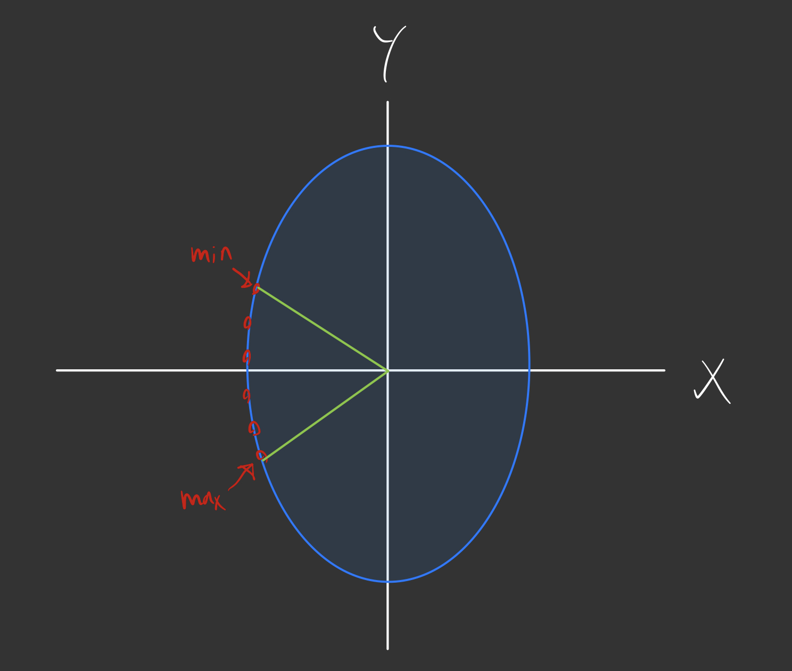

# Linearizing a magnetic encoder
## Problem overview
The inputs to the system are given as a set of points along a elipse (shown in red).

**Important:** The points in red are the only data given. The elipse is initially unknown.

Given some vector `v1`. If `v1` moves along the elipse between `max` and `min` at a constant rate, the dθ/dt will not be constant. I want it to be constant.

The solution I came up with is to apply a linear transformation that normalizes the X and Y axis resilting in a unit circle.

To find this transformation I need to aproximate the elipse based off of the data points inorder to find the stretch in each axis. I think a good way to achieve this is to solve it like a least squares system to find the elipse with the least error. (The input is from physical hardware and will have some noise in the input so points wont lie exactly on an elipse).

My question boils down to:
- How do I set up the system?
- Is this possible to be solved with least squared?
If I can find the elipse that provides the least squared error to the inputs

# Aditional Information
- The set of input point is not necesairly center on one of the axis. I just drew it that way for the example. 
- The points hav a constraint. They will not span the whole space and will be constrained to about ~70 degreese of a section of an elipse. 
- The problem needs to be solvable regardless of what part of the elips the group of points lies on.
